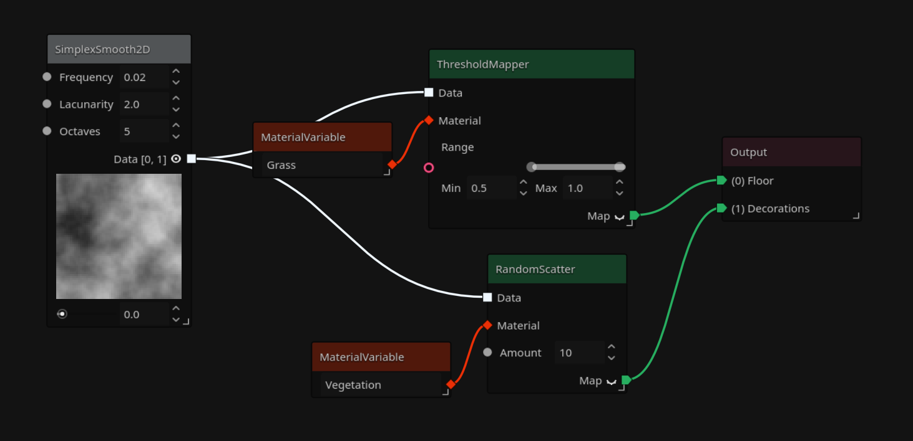
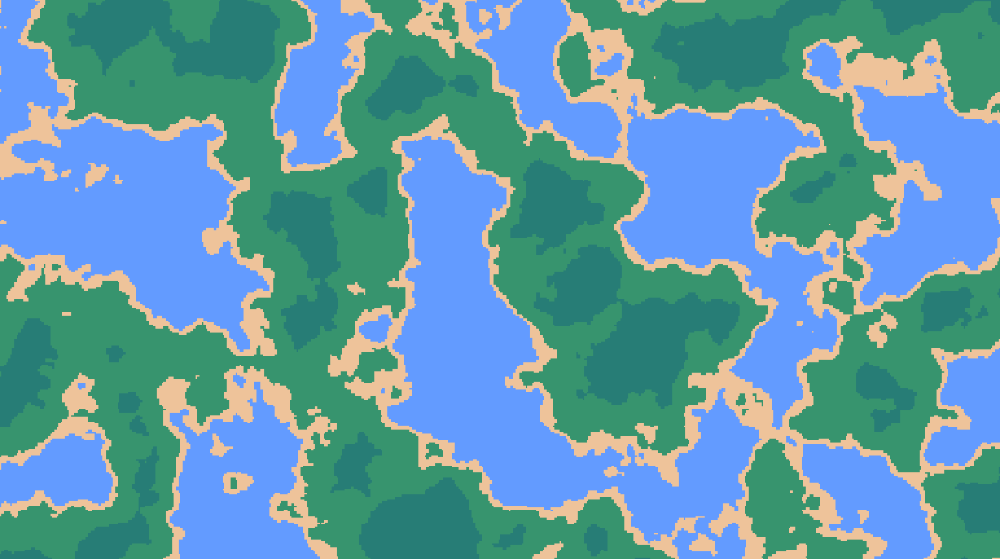
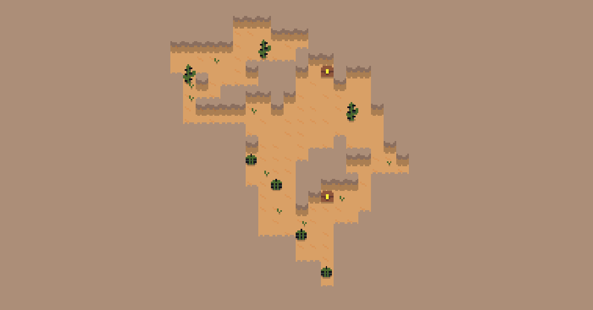

# 🌍 Gaea 2.0

Gaea 2.0 is an **add-on for Godot 4.6**, designed to empower your project with advanced **procedural generation** capabilities.

!!! note
    Gaea 2.0 is currently in early development, and is NOT ready for bigger projects. It's constantly growing and can have breaking changes every update. Please stay with 1.X if your work is important. No migration is possible from version 1.X to version 2.0.

### What's in a Name?

**Gaea**, in Greek mythology, is the personification of Earth - a nod towards the terrain and world generation capabilities this addon brings to your game development toolkit. Plus, we think it sounds pretty cool.

# 💫 The Idea

Gaea uses a graph system to create a flow of customizable nodes for endless possibilities in generation, both 2D and 3D. Creating custom nodes is easy, too, so you aren't limited by what the addon has.

Gaea 2.0 can generate terrains such as:

