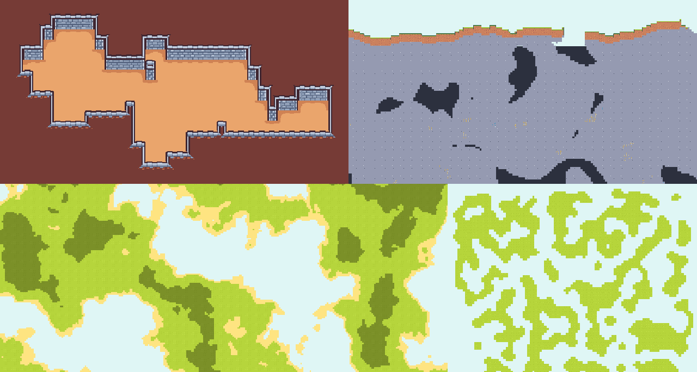
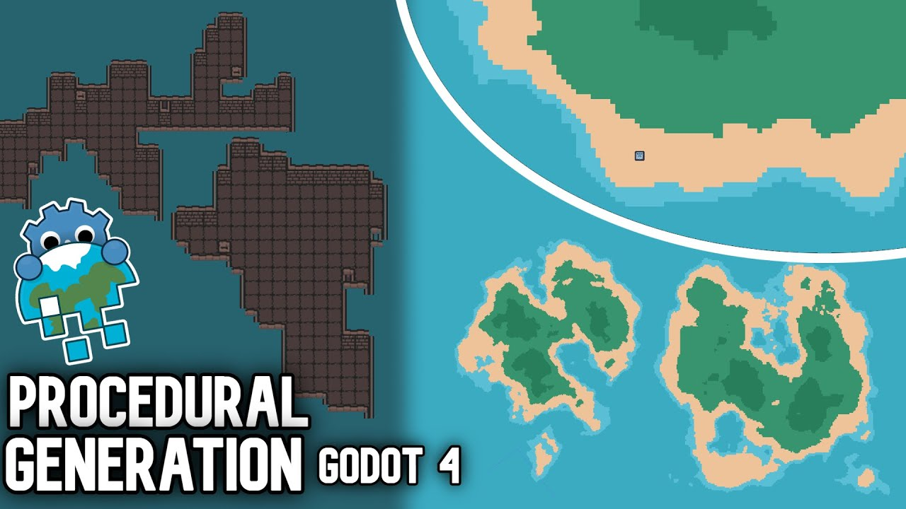
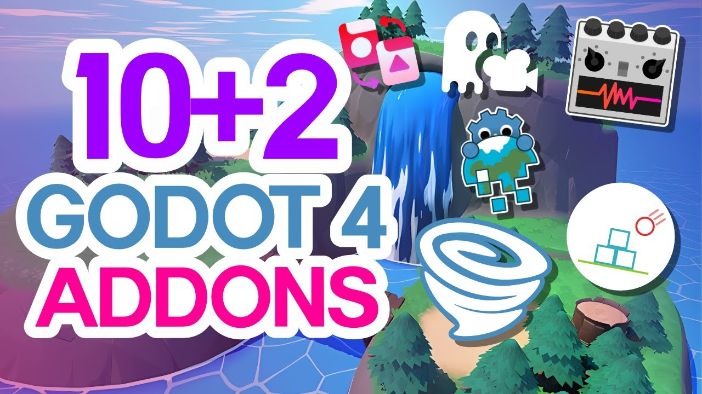

# 🌍 Gaea 1.X

Gaea 1.X is an **add-on for Godot 4.3***, designed to empower your project with advanced **procedural generation** capabilities.

*For 4.2, use v1.1.3 or lower. For 4.0-4.1, use v0.6.2 or lower.

# 💫 Key Features

## Generators
Our collection of generators, including Cellular, Heightmap, and Walker, allow for dynamic and unique world creation. Whether you're looking to create intricate cave systems or sprawling landscapes, Gaea's got you covered.

## Modifiers
Further fine-tune your procedurally generated worlds with our set of modifiers. Add layers of complexity and fine-tune the details to create environments that truly come alive.

## Renderers
`GaeaRenderers` are nodes that take the generator's data to **render** the generation. They can be used for drawing in a TileMap, a GridMap, a mesh, a texture, or whatever you can code.

## Chunk loading
Gaea comes with a `ChunkLoader` node that can generate an area around an `actor`, allowing both for infinite worlds and to optimize big worlds. 

# Videos
#### A great tutorial for beginners:

