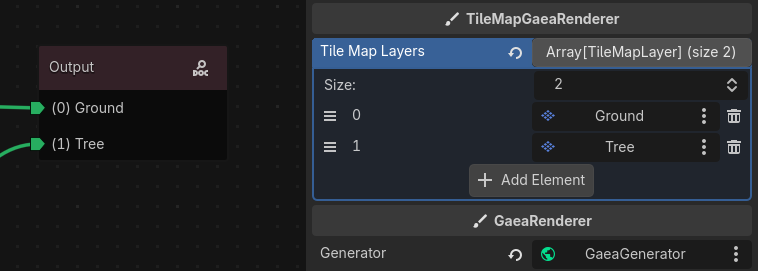

# GaeaRenderer

`GaeaRenderer` takes the `GaeaGrid` produced by a `GaeaGenerator` and draws it into your scene.

This is an abstract base class. On its own, it does not render anything, but it defines the common behavior used by all renderer implementations.

Gaea provides two built-in renderers: `TileMapGaeaRenderer` and `GridMapGaeaRenderer`. They render to [`TileMapLayer`](https://docs.godotengine.org/en/stable/classes/class_tilemaplayer.html) and [`GridMap`](https://docs.godotengine.org/en/stable/classes/class_gridmap.html) nodes respectively, using `TileMapGaeaMaterial` and `GridMapGaeaMaterial` values from the generated grid. See [Built-in Renderers](#built-in-renderers) for details.


## Typical Scene Setup

The most common setup is:

1. Add a `GaeaGenerator` to your scene.
2. Add a `TileMapGaeaRenderer` node.
3. Assign the generator to the renderer's `generator` property.
4. Assign the target render nodes used by that renderer, a [`TileMapLayer`](https://docs.godotengine.org/en/stable/classes/class_tilemaplayer.html) in this case.

This setup is described in [How Gaea Works](../the-basics/how-gaea-works.md).

## Generator Connection

When a renderer is assigned a generator, it automatically connects to these generator signals:

- `generation_finished`: calls `render(grid)`.
- `area_erased`: calls `erase_area(area)`.
- `reset_requested`: calls `reset()`.

This means a renderer usually does not need manual signal wiring. Once the `generator` property is set, it will react to new generation results automatically.

## Layer Mapping

Both built-in renderers work by matching generated layers to scene nodes by index.

For example:

- generated layer `0` (here Ground) renders to `tile_map_layers[0]`
- generated layer `1` (here Tree) renders to `tile_map_layers[1]`



!!! info
    Keep the renderer arrays aligned with the graph layer order to avoid rendering data to the wrong target node.

## Built-in Renderers

Gaea currently provides two built-in renderers.

### TileMapGaeaRenderer

`TileMapGaeaRenderer` renders `TileMapGaeaMaterial` values onto [`TileMapLayer`](https://docs.godotengine.org/en/stable/classes/class_tilemaplayer.html) nodes.

It uses the `tile_map_layers` array, where each entry corresponds to one generated layer. If the generated grid has multiple layers, the renderer will try to render each one to the matching [`TileMapLayer`](https://docs.godotengine.org/en/stable/classes/class_tilemaplayer.html) .

It supports several tile placement modes through the material:

- single-cell placement
- terrain connection placement
- pattern placement

It also converts Gaea grid coordinates to the correct [`TileMapLayer`](https://docs.godotengine.org/en/stable/classes/class_tilemaplayer.html) coordinates based on the [`TileSet`](https://docs.godotengine.org/en/stable/classes/class_tileset.html) layout and shape. See pull request [#339](https://github.com/gaea-godot/gaea/pull/339) for details on how this works.

The tilemap renderer has its own coordinate system, which means that the generated grid coordinates are converted to the correct tilemap coordinates based on the [`TileSet`](https://docs.godotengine.org/en/stable/classes/class_tileset.html) layout and shape. This allows you to use any [`TileSet`](https://docs.godotengine.org/en/stable/classes/class_tileset.html) configuration without worrying about coordinate mismatches. The render class provides two static methods to help with this conversion, check the built-in documentation for details.

### GridMapGaeaRenderer

`GridMapGaeaRenderer` renders `GridMapGaeaMaterial` values onto [`GridMap`](https://docs.godotengine.org/en/stable/classes/class_gridmap.html) nodes.

It uses the `grid_maps` array, where each entry corresponds to one generated layer. Each matching cell is written with the material's mesh item index and orientation.

## Signals

The renderer emits the following signals:

- `render_finished`: emitted when rendering is complete.
- `render_reset`: emitted when `reset()` is called.
- `area_erased(area: AABB)`: emitted when a rendered area is erased.

## Custom Renderers

To create your own renderer, extend `GaeaRenderer` class and implement the three abstract methods:

```
@tool
class_name MyRenderer
extends GaeaRenderer

func _render(grid: GaeaGrid) -> void:
	pass

func _erase_area(area: AABB) -> void:
	pass

func _reset() -> void:
	pass
```

This is the right approach when you want to render to a custom scene structure, a preview widget, or a game-specific visual system.

## Troubleshooting

- If nothing is rendered, verify that the renderer has a valid `generator` assigned.
- If only some layers appear, check that the renderer array size matches the graph layer count.
- If rendering goes to the wrong positions in a [`TileMapLayer`](https://docs.godotengine.org/en/stable/classes/class_tilemaplayer.html) , verify the [`TileSet`](https://docs.godotengine.org/en/stable/classes/class_tileset.html) layout and shape configuration.
- If old 3D cells remain visible in a `GridMap`, make sure rendering and reset flow matches your expected behavior.