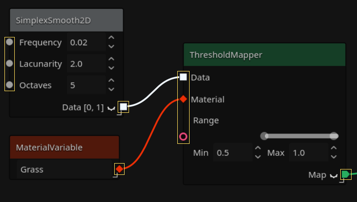
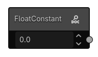
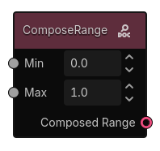
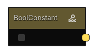
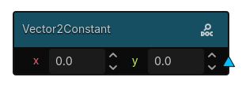
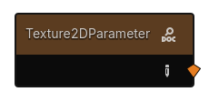
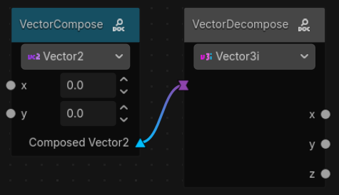
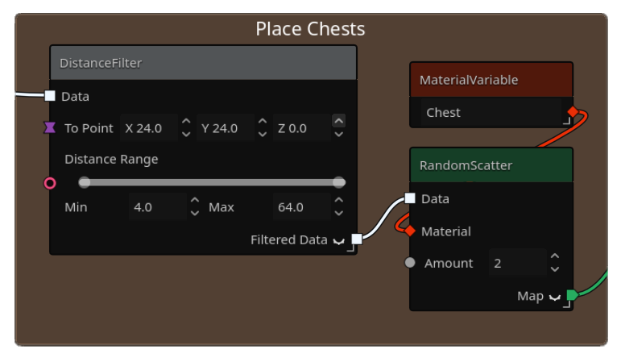
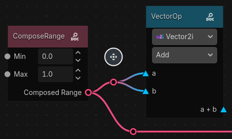

# Anatomy of a Graph

Graphs in Gaea all have to lead to the Output Node in order for the generation to work. You can't create loop connections in Gaea. Every connection must lead to the Output Node, with no cycles. If you try to create a loop, Gaea removes the link.

Let's take a look at what each element in the nodes mean:

## Slots

Gaea nodes have input and output slots. On the left side of the node, we have the input ones, and on the right, the output ones. Input slots for arguments (such as in the SimplexSmooth2D node, allow for overriding the values set in the node interface, but are optional).

This is how you'll connect nodes to each other. 

### Slot Types
Slot types are differentiated by their colors:

| Type | Color & Shape | Description | Example |
| --- | --- | --- | --- |
| Number | Gray Circle | Can be a `float` or an `int`. |  |
| Material | Red Diamond | A [`GaeaMaterial`](material.md) resource. |  |
| Sample | White Square | A grid of `float`s. |  |
| Map | Green Tag | A grid of [`GaeaMaterial`](material.md)s. |  | 
| Range | Pink donut | A range between one number and another |  |
| Boolean | Yellow Rounded Square | `true` or `false` |  |
| Vector2/3 | Light Blue Triangle/Purple Hourglass | 2/3 numbers: `x`, `y` and `z` |   |
| Texture | Orange Diamond | A `Texture` resource |  |

### Slot Conversions

Some types can be converted to others. For example, a `float` and an `int` share the same slot type, and can be converted to each other.

Some nodes also have implicit conversions. For example, the `Vector2` can be implicitly converted to a `Vector3` with a `z` value of 0. The `float` can be implicitly converted to a `Vector2` or `Vector3` with all values set to the float value. If the conversion is not possible you won't be able to connect the nodes together. Check the `GaeaValueCast` class for more details on the available conversions.

# Special Nodes

## Frame

Frames can be used to organize your graphs. You can attach nodes to them, and they'll automatically resize to fit them. Right click frames to get option dropdowns, such as: changing the title, changing the background color, etc.

To create a frame, select multiple nodes and use the "Group into Frame" option in the context menu. You can also use the "Add Node" button in the toolbar and select "Frame" from the list.

## Reroute node

Reroute nodes are used to organize your graphs and make them more readable. They don't do anything by themselves, but they can be used to split connections and make them easier to follow.

Right click on a connection between two nodes and select "Insert Reroute Node" to add a reroute node in the middle of the connection. You can then move the reroute node using the move button when selected.

When the reroute node is deleted, the connection will be re-established between the two (or more) nodes it was connecting.

