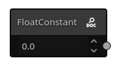
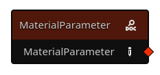
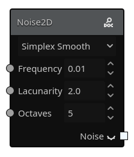
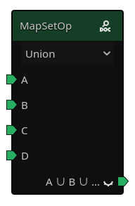
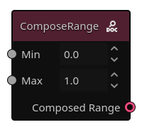
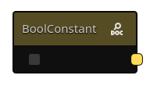
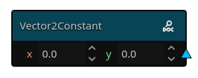
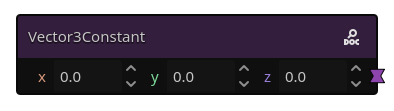
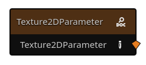

# Anatomy of a Graph

Graphs in Gaea all have to lead to the Output Node in order for the generation to work. Let's take a look at what each element in the nodes mean:

## Slots

Gaea nodes have input and output slots. On the left side of the node, we have the input ones, and on the right, the output ones. Input slots for arguments (such as in the SimplexSmooth2D node, allow for overriding the values set in the node interface, but are optional).

This is how you'll connect nodes to each other. 

### Slot Types
Slot types are differentiated by their colors:

| Type | Color & Shape | Description | Example |
| --- | --- | --- | --- |
| Number | Gray Circle | Can be a `float` or an `int`. |  |
| Material | Red Diamond | A `GaeaMaterial` resource. Learn more about it in [How Gaea Works](how-gaea-works.md) |  |
| Sample | White Square | A grid of floats. |  |
| Map | Green Tag | A grid of `GaeaMaterial`s. |  | 
| Range | Pink Ring | A range between one number and another |  |
| Boolean | Yellow Rounded Square | `true` or `false` |  |
| Vector2/3 | Light Blue Triangle/Purple Hourglass | 2/3 numbers: `x`, `y` and `z` |   |
| Texture | Orange Diamond | A `Texture` resource |  |

# Special Nodes

## Frame

Frames can be used to organize your graphs. You can attach nodes to them, and they'll automatically resize to fit them. Right click frames to get option dropdowns, such as: changing the title, changing the background color, etc.
