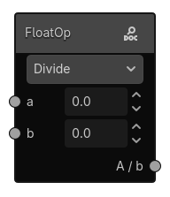
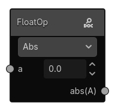
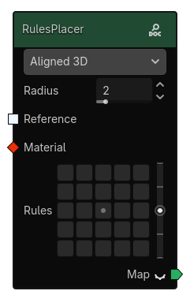
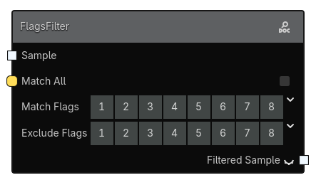
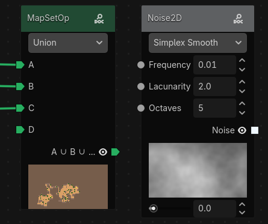

# Anatomy of a Node

Nodes are the building blocks of a graph. Each node does one job: produce data, transform data, or output data. By connecting nodes together, you create a graph that defines how your terrain is generated.

In this page, we use the `Noise2D` node as a concrete example.

## What You See On a Node

Most nodes contain the same core parts:

- **Title bar**: the node name (for example, `Noise2D`). The title bar color indicates the node type derived from the first output slot type.
- **Enum**: dropdowns to select from predefined options (for example, noise type).
- **Argument (with left slot)**: editable parameters such as numbers, booleans. Some argument can't be edited directly and must be connected to another node.
- **Output (with right slot)**: values produced by this node. Some of theses output can be previewed directly from the node, you can press the eye icon next to the output slot to preview it.
- **Salt**: a hidden random salt value used by procedural nodes to generate different outputs. Each node has its own salt, the value is generated randomly when the node is created.

## Enums
Enums are dropdowns that let you select from predefined options. They can change the node behavior and available argument or outputs.

A node can have multiple enums. For example, `FloatOp` has a operation enum that lets you choose between different operations (Add, Subtract, Multiply, Divide, etc.). Depending on the selected operation, different fields may be available to tweak the settings.

## Arguments and outputs slots

Arguments are editable parameters that control how the node behaves. They can be numbers, booleans, resources, or other types. Most of the arguments have an input slot on the left side of the node, which allows you to connect outputs from other nodes. Some types require you to connect another node to set their values.

Outputs are the values produced by the node. The output slot type determines what kind of data it produces (for example, a `Noise2D` node has a `Sample` output slot that produces a grid of `float`s). The grid size is determined by the currently generated area size.

Slots define how nodes connect and what data they accept.

- Inputs receive data.
- Outputs send data.
- A connection is valid only when slot types are compatible.

Some arguments like the `radius` in the `RulesPlacer` node can't be connected to other nodes and must be edited directly in the node interface. It's used to control the size of the grid in the `rules` argument.

For a full list of slot types and colors, see [Anatomy of a Graph > Slot Types](anatomy-of-a-graph.md#slot-types).

## Preview of nodes outputs

Some nodes provide preview actions to inspect results while building a graph. You can preview outputs directly from the node by clicking the eye icon next to the output slot.

For a `Sample` output, the preview will show a 2D representation of the grid in a grayscale image. A range slider will appear next to the preview to let you adjust the displayed range of values.

For a `Map` output, the preview will show a colored representation of the grid based on the `preview_color` of each material.

