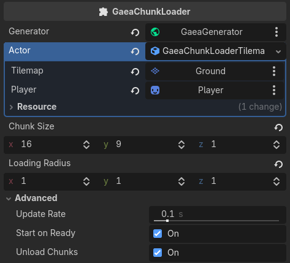

# GaeaChunkLoader

`GaeaChunkLoader` is a scene node that divides the world into chunks and generates them on demand around a moving actor (typically the player). It is designed for open-world or infinite worlds where the full map cannot be generated all at once.

## How It Works

The chunk loader polls the actor's position at a regular interval. When the actor moves into a new chunk, the loader:

1. Calculates which chunks fall within the `loading_radius` around the actor.
2. Requests generation for any chunk not yet loaded.
3. Optionally erases chunks that are no longer in range (if `unload_chunks` is enabled).

Chunks are defined by their `chunk_size` and identified by their integer position in chunk space.

## Properties

| Property | Type | Default | Description |
| --- | --- | --- | --- |
| `generator` | `GaeaGenerator` | — | The generator node used to generate and erase chunk areas. |
| `actor` | `GaeaChunkLoaderActor` | — | Resource that provides the actor's position in chunk space. |
| `chunk_size` | `Vector3i` | `(16, 16, 1)` | Size of each chunk in world units. |
| `loading_radius` | `Vector3i` | `(2, 2, 1)` | How many chunks to load in each direction around the actor. |
| `update_rate` | `float` | `0.1` | Interval in seconds between position checks. `0.0` checks every frame. |
| `start_on_ready` | `bool` | `true` | If `true`, starts loading automatically when the node enters the scene tree. |
| `unload_chunks` | `bool` | `true` | If `true`, erases chunks that leave the loading radius. |

## Methods

| Method | Description |
| --- | --- |
| `start()` | Starts the loading loop. Called automatically on ready if `start_on_ready` is `true`. |
| `stop()` | Stops the loading loop. |

## Actors

Actors are small resources that tell the chunk loader where the tracked entity is. 

The actor resource must match the type of renderer you're using. For example, if you're using a `TileMapGaeaRenderer`, use a `GaeaChunkLoaderTilemapActor` and assign the target `TileMapLayer`. If you're using a `GridMapGaeaRenderer`, use a `GaeaChunkLoaderGridmapActor` and assign the target `GridMap`.

Two built-in actors are provided:

### GaeaChunkLoaderTilemapActor

Used for 2D games with a `TileMapLayer` renderer.

| Property | Type | Description |
| --- | --- | --- |
| `tilemap` | `NodePath` | Path to the `TileMapLayer` node. |
| `player` | `NodePath` | Path to the `Node2D` actor to track. |

The actor converts the player's 2D map position into chunk coordinates automatically.

### GaeaChunkLoaderGridmapActor

Used for 3D games with a `GridMap` renderer.

| Property | Type | Description |
| --- | --- | --- |
| `gridmap` | `NodePath` | Path to the `GridMap` node. |
| `player` | `NodePath` | Path to the `Node3D` actor to track. |

The actor converts the player's 3D map position into chunk coordinates automatically.

### Custom Actors

You can create your own actor by extending `GaeaChunkLoaderActor` and implementing two methods:

- `get_actor_chunk_position(chunk_loader, chunk_size) -> Vector3i` — returns the current chunk position of the actor.
- `is_actor_valid(chunk_loader) -> bool` — validates that required nodes are present.

## Setup

1. Add a `GaeaChunkLoader` node to your scene.
2. Assign your `GaeaGenerator` node to the `generator` property.
3. Create a `GaeaChunkLoaderTilemapActor` or `GaeaChunkLoaderGridmapActor` resource and assign it to `actor`.
4. Set `chunk_size` and `loading_radius` to match your game's scale.
5. Run the scene. The loader starts automatically and generates chunks as the player moves.