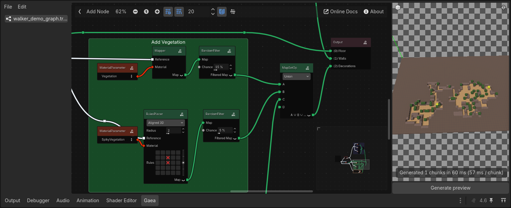

# Gaea Panel

The Gaea Panel is the main editor workspace for building and previewing graphs. The panel opens automatically when you create or open a `GaeaGraph` resource. The design is similar to Godot's built-in Shader Editor.

It is split into three main areas:

- Left: Graph files and graph/file actions
- Center: Graph editor
- Right: 3D preview panel

## Left Area: File List and Menus

The left area lists opened graph resources and provides editing actions.

The File menu includes actions for managing graph resources.

The Edit menu includes graph editing actions.

Some actions are also available from keyboard shortcuts or right-click context menus in the graph editor.

!!! tip
	You can export selected nodes as readable JSON to share them easily with other users. Use the "Copy to Clipboard" action, then paste the JSON in a text file or directly in a GitHub issue or discussion. To import back into Gaea, copy the JSON and use "Paste from Clipboard" in the Edit menu.

## Center Area: Graph Editor

The center area is the graph editor where you create nodes and connections.

Toolbar buttons include:

- Toggle Files Panel
- Add Node
- Zoom actions (fit, zoom in/out, reset zoom)
- Grid options (toggle, snap, size)
- Online Docs
- About

The Add Node action opens the node creation popup and places nodes near the current graph view.

You can also right-click in the graph editor to open a context menu, there is two context menus: one for selected nodes or frame, one for links between nodes. Both include relevant actions such as adding nodes, deleting, copying/pasting, and more.

!!! tip
    You can learn more about the graph editor and its features in the [Anatomy of the Graph](anatomy-of-a-graph.md) page.

## Right Area: Preview Panel

The right area renders a live preview of your graph output in a 3D viewport.

### Generate preview

Press **Generate** to simulate chunks using the current graph preview settings.

The panel:

- Builds chunk areas from `preview_world_size`, `preview_chunk_size`, and `preview_chunk_count`
- Runs generation tasks in a task pool
- Draws results progressively in the viewport
- Shows generation progress and timing in the bottom label

### Camera and view controls

Preview camera controls:

- Left mouse drag: Orbit
- Right mouse drag: Pan
- Mouse wheel: Zoom

You can also reset the camera view to frame by clicking the cube icon on the top left of the viewport.

### Preview display behavior

- Preview colors come from each material's `preview_color`.
- Overlay formats merge enabled layers into one preview layer.
- Stacked formats draw layers above each other.

## About Window

The About button opens a popup with:

- Current Gaea version (linked to the matching GitHub release)
- Contributors list
