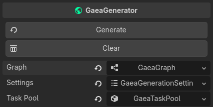
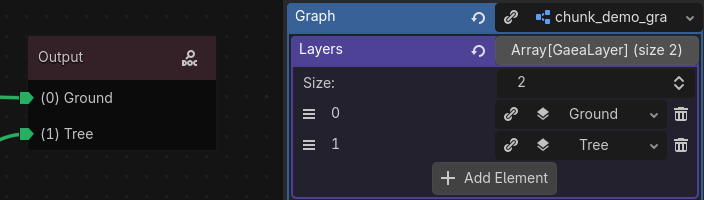
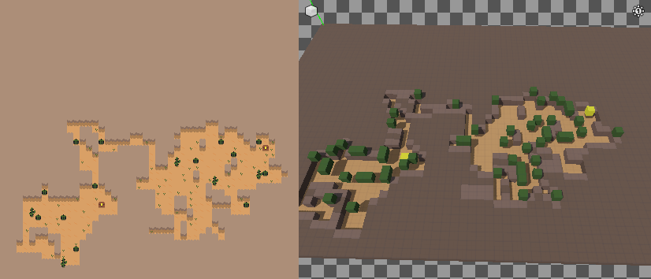
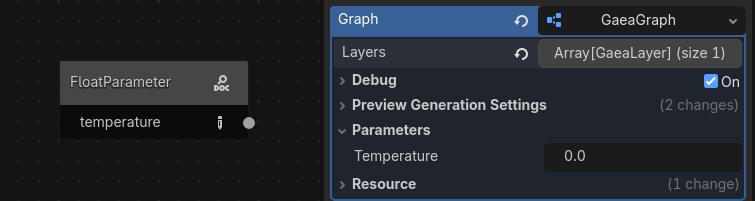

# GaeaGenerator

`GaeaGenerator` is the node that executes your graph and produces a `GaeaGrid` that renderers can display in-game. A grid can have multiple layers, and each cell in the grid contains a `GaeaMaterial` that tells renderers what to draw.

It needs 3 resources to run:

- `GaeaGraph`: contains graph nodes and their connections.
- `GaeaGenerationSettings`: contains generation options such as seed and world size.
- `GaeaTaskPool`: manages generation tasks and multithreading behavior.



## Typical Scene Setup

The most common setup is:

1. Add one `GaeaGenerator` to your scene.
2. Assign a graph to `graph`.
3. Assign generation settings to `settings`.
4. Add one or more `GaeaRenderer` nodes that listen to this generator.

This setup is described in [How Gaea Works](../the-basics/how-gaea-works.md).

## GaeaGraph

The graph is usually saved as its own `.tres` resource, but it can also be embedded as a sub-resource in the generator. It is made of nodes and connections that define data flow. Each node has a specific role, and the output node determines what is generated.

Adding the `GaeaGenerator` to your scene tree and selecting it will open the graph in the Gaea panel at the bottom of the editor.

### Graph layers

A graph can have multiple layers, which helps you split generation into clear responsibilities. This is especially practical for tile-based workflows: one layer for base terrain, one for props, one for enemies, and so on.

During generation, `GaeaGenerator` processes all enabled layers and combines them into a single `GaeaGrid` that renderers can display.

!!! info
    For better readability in the graph, give each layer a meaningful name with `resource_name`. Each layer appears as an output port on the output node.

    

### Debug options

`GaeaGraph` has built-in debug options to inspect generation internals. Use them when tracking generation issues.

Available logging categories are:

- `Execute`: Log execution data such as current area & current layer.
- `Traverse`: Log traverse data (which nodes are being traversed in the graph).
- `Data`: Log which data is being generated from which port.
- `Arguments`: Log which arguments are being grabbed.
- `Threading`: Log thread creation and process.

### Preview Generation Settings

The generator can produce a preview of the generated world in the Gaea Panel. These settings are stored on the graph and used by the panel to render the preview. On the right side of the Gaea Panel, you can see a 3D viewport where each cell is displayed as a colored cube based on its material. This lets you inspect and debug a graph without connecting a renderer. Because Godot uses different coordinate conventions in 2D and 3D, you can choose from multiple preview coordinate formats.

The image below shows the same graph in 2D game rendering on the left and in the 3D preview on the right. The yellow chests and green vegetation appear in the same positions in both views.



You can configure the preview generation with the following graph properties:

- `preview_coordinate_format`: How generated cells are displayed in preview (2D overlay/stacked or 3D perspective). A stacked format mean that each layer is displayed on top of the previous one, which can help debug layer composition issues. A overlay format will display all layers in the same 3D space.
- `preview_seed`: Seed used specifically for preview generation.
- `preview_size_preset`: Preset of chunk size used for generating preview. (`SINGLE_2D`, `MULTIPLE_2D`, `SINGLE_3D`, `MULTIPLE_3D`, `MULTIPLE_3D_FULL_HEIGHT`, `CUSTOM`).
- `preview_world_size`: Size of the generated world in the preview.
- `preview_chunk_size`: Size of the generated area in the preview.
- `preview_chunk_count`: How many chunks are generated in the preview.

### Parameters

Graphs can expose runtime-editable values through `GaeaNodeParameter` nodes. Multiple parameter types are supported, including `float`, `int`, and `bool`, and they can be used by any graph node that supports parameters. A parameter node only stores a name, and that name becomes the parameter name shown in the graph inspector. You can rename it from the graph node with the pen icon on the right.



At runtime, you can read and write parameter values directly on the graph:

```
if generator.graph.has_parameter(&"temperature"):
    generator.graph.set_parameter(&"temperature", 0.85)
```

The `GaeaGraph` class has helper methods to work with parameters:

- `has_parameter(name: StringName) -> bool`
- `get_parameter(name: StringName) -> Variant`
- `set_parameter(name: StringName, value: Variant)`
- `get_parameter_list() -> Dictionary[StringName, Variant]`

This is the preferred way to drive one graph from gameplay state without duplicating resources.

!!! warning
    Editing parameter values during generation is not recommended and can produce unexpected results.

Learn more about the graph itself in [Anatomy of a graph](../the-basics/anatomy-of-a-graph.md).

## GaeaGenerationSettings

`GaeaGenerationSettings` controls how the graph is generated.

- `random_seed_on_generate`: when enabled, each `generate()` call picks a new random seed.
- `seed`: seed used for deterministic generation when random seed is disabled.
- `world_size`: size of the generated area. For 2D worlds, keep `z = 1`.

!!! note
    For chunk-based or infinite generation, use a chunk loader node instead of relying only on a single static `world_size`. See [GaeaChunkLoader](../the-basics/chunk-loader.md) for more details.

## GaeaTaskPool

`GaeaTaskPool` handles execution scheduling and multithreading.

Options:

- `multithreaded`: if enabled, tasks run through `WorkerThreadPool`.
- `task_limit`: maximum number of tasks that can run at the same time (`0` means no queue limit).
- `duplication_strategy`: controls behavior when duplicate tasks are submitted.

!!! tip
    You can use `GaeaGenerationPriority.get_recommended_task_limit(chunk_count: int)` to get a `task_limit` based on the number of chunks being generated and the number of CPU cores available.

## Generation Flow

`GaeaGenerator` exposes multiple entry points:

- `generate(origin: Variant = null)`: Start the generaton process. First resets the current generation, then generates the whole world_size. 
- `generate_area(area: AABB, origin: Variant = null)`: generates only a specific [`AABB`](https://docs.godotengine.org/en/stable/classes/class_aabb.html) region.
- `cancel_generation()`: Cancels the current generation tasks, if any.
- `request_reset()`: Emits `reset_requested`. Does nothing by itself, but notifies `GaeaRenderers` that they should reset the current generation.
- `request_area_erasure(area: AABB)`: Emits `area_erased` signal. Does nothing by itself, but notifies `GaeaRenderers` that they should erase the points of area.

In the generate functions you can optionally pass an `origin` argument to prioritize tasks. For example, the player position can be passed to prioritize nearby generation tasks. See `GaeaGenerationPriority._origin` for origin type.

When generation starts, the generator queues a `GaeaGenerationTask`, executes the graph, then emits `generation_finished(grid)` when results are ready.

Another way to generate chunks is to use a `GaeaChunkLoader` node, which calls `generate_area()` automatically based on player movement and chunk loading state. See [GaeaChunkLoader](../the-basics/chunk-loader.md) for more details.

## Signals

The generator emits several signals you can connect to game logic:

- `graph_changed(old_graph: GaeaGraph)`: Emitted when GaeaGraph is changed.
- `about_to_generate`: Emitted when the graph is about to generate.
- `generation_started()`: Emitted when a `GaeaGenerationTask` is queued.
- `generation_cancelled()`: Emitted when a `GaeaGenerationTask` is canceled.
- `generation_finished(grid: GaeaGrid)`: Emitted a `GaeaGenerationTask` has finished. The generated grid is passed as an argument.
- `reset_requested`: Emitted when this generator wants to trigger a reset.
- `area_erased(area: AABB)`: Emitted when an area is erased.

## Troubleshooting

- If nothing appears on screen, verify the output graph node is connected and a renderer is connected to this generator.
- If generation seems non-deterministic, disable `random_seed_on_generate` and set a fixed `seed`.
- If generation feels delayed under heavy load, tune `task_limit` or reduce generated area size.
