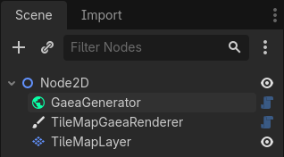
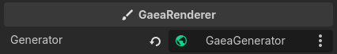

# How Gaea Works

Gaea revolves around two core nodes: the **generator** and the **renderer**. The generator creates the data that describes your world, and the renderer turns that data into visuals in-game. This separation lets you use the generator on its own, or connect multiple renderers, for example a `TileMapRenderer` for gameplay and a custom renderer for a GUI preview.

The easiest way to learn Gaea is to download and explore the demo setups from the [gaea-demos repository](https://github.com/gaea-godot/gaea-demos/tree/2.0).

The basic setup is to have one generator, one renderer and a Godot node (here the [TileMapLayer](https://docs.godotengine.org/en/stable/classes/class_tilemaplayer.html) node) for the render.

## Generator

The generator node need 3 resources to work: the `GaeaGraph` which contains the graph nodes and connections between them, the `GaeaGenerationSettings` which contains settings for the generator like the seed and the world size, and the `GaeaTaskPool` which contains the thread pool used to run the generator on a separate thread.

Learn more about the generator in [GaeaGenerator](generator.md).

## Renderer

The `GaeaRenderer` takes what the generator creates, and draws it in the game. Gaea has 2 built-in renderers: the `TileMapRenderer` and the `GridMapRenderer`. They use `TileMapMaterial`s and `GridMapMaterial`s respectively, which tell them which tiles in the tileset or which elements in the gridmap to draw on screen.

Learn more about the renderer in [GaeaRenderer](renderer.md).
