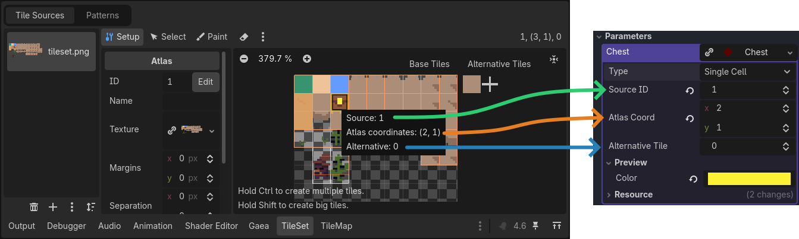
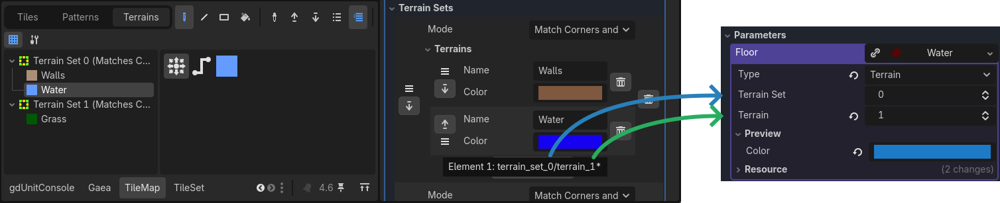
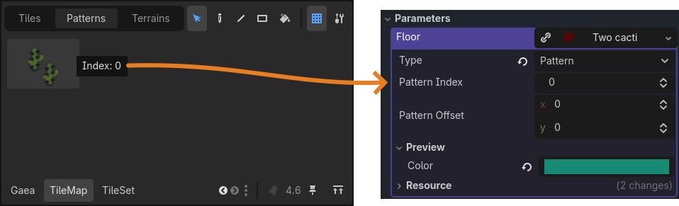
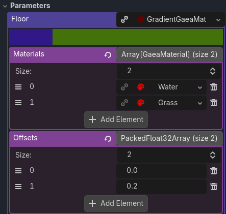
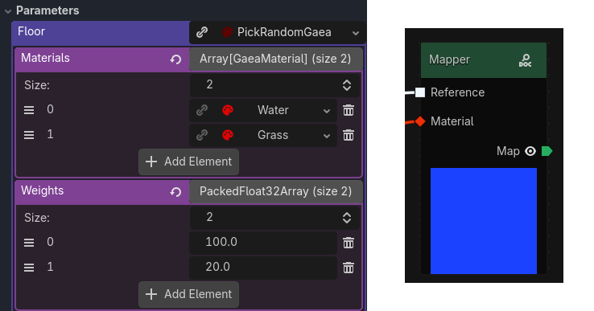
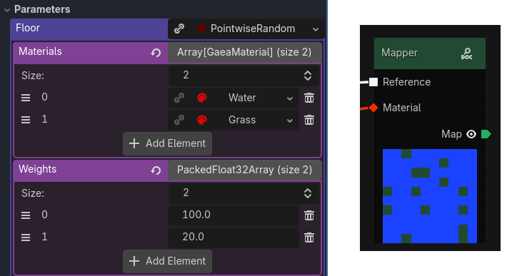

# Materials

The result of generation is a grid of materials. They describe what should be placed at each point in your world. Each cell contains one material, which tells the renderer what to draw (a tile, a 3D object, or anything else, depending on the renderer).

You must use the `GaeaMaterial` that matches your renderer (for example, `TileMapMaterial` for TileMap rendering, `GridMapMaterial` for GridMap rendering, or a custom material for custom rendering).

A material is a resource and can't be added directly in the graph. Instead, you use nodes like `MaterialParameter` to create material instances and connect them to the graph. The parameter node will expose a new Parameter in the graph inspector, where you can assign a material resource. This allows you to reuse the same material in multiple places and change it easily from the inspector.

A material have a `preview_color` property that is used in the Gaea Panel 3D viewport or the node preview.

## Preview Color

All materials have a `preview_color` property. This color is shown in the Gaea Panel 3D viewport to help you visualize your generation without connecting a full renderer.

## Two kinds of materials

Materials come in two flavors:

- **Data materials**: store concrete data for TileMap or GridMap rendering.
- **Distribution materials**: pick or generate data materials based on rules.

## Data materials

Data materials hold the actual rendering data. They are concrete and ready for the renderer to use.

Gaea provide two data materials to be used with the two provided renderers:

| Material | Purpose |
| --- | --- |
| `TileMapMaterial` | Stores a tile infos for TileMap rendering. |
| `GridMapMaterial` | Stores a item index and optional orientation for GridMap rendering. |
| Custom materials | Any custom subclass of `GaeaMaterial` for custom rendering. |

### TileMapMaterial

A `TileMapMaterial` holds a multiples properties that corresponds to a tile in your TileSet. The renderer support three tile types:

- **Single**: a single tile from the [TileSet](https://docs.godotengine.org/en/stable/tutorials/2d/using_tilesets.html#doc-using-tilesets).
- **Terrain**: a tile that can blend with its neighbors, using [Godot's terrain system](https://docs.godotengine.org/en/stable/tutorials/2d/using_tilemaps.html#handling-tile-connections-automatically-using-terrains).
- **Pattern**: a set of tiles, using [Godot's pattern system](https://docs.godotengine.org/en/stable/tutorials/2d/using_tilemaps.html#saving-and-loading-premade-tile-placements-using-patterns).

#### Single cell

To correctly set the material for a single cell, set the type to `Single Cell`. Then, set the `Source ID`, `Atlas Coord` and `Alternative Tile` of your tile, you can see the values by hovering your Tile in the TileSet editor.

#### Terrain

To correctly set the material for the terrain, set the type to `Terrain`. Then, set the `Terrain Set` and `Terrain` ids of your terrain. The easy way to get the correct values is to mouse hover the terrain sets in the inspector from the TileSet resource.

#### Pattern

To correctly set the material for a pattern, set the type to `Pattern`. Then, set the `Pattern Index` id of your pattern. The easy way to get the correct values is to mouse hover the pattern in the inspector from the Tilemap panel.

You can optionally set the `Pattern Offset` to shift the pattern by a certain amount of cells. Most of the time you will want to center the pattern by setting the offset to half the pattern size (for example, for a 2x2 pattern, set the offset to (-1, -1)).

## Distribution materials

Distribution materials do not hold final data. Instead, they pick data materials based on a rule. They are processed during rendering to produce actual data.

### Gradient material

A `GradientGaeaMaterial` maps a float value (from the sample grid) to a data material based on defined thresholds. Can be used for terrain transitions (for example, sand → grass → snow based on height). Usually the thresholds are between 0 and 1, but they can be outside this range as well.

The material at index `n` will be used for values between the offset at index `n` and the offset at index `n + 1` (or infinity for the last material).

### Pick Random material

A `PickRandomGaeaMaterial` selects a random data material from a list using a weight for each material. The selection is based on the seed of the generation, so it will be consistent across generations. The selection is done only once per generation, so the same material will be used for the entire area.

### Pointwise Random material

A `PointwiseRandomGaeaMaterial` selects a random data material from a list using a weight for each material. The selection is based on the seed of the generation, so it will be consistent across generations. The selection is done for each cell.

## Custom materials

You can create your own custom materials by creating a new class that inherits from `GaeaMaterial` or any of the existing materials. For example you can set a material that fetch tiles directly from the tileset using painted properties. See the built-in comments about the `GaeaMaterial` class for more details on how to create custom materials.
