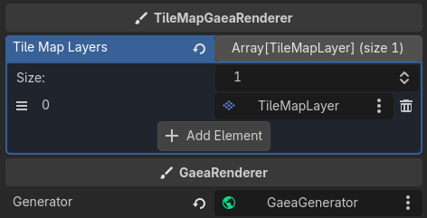
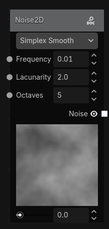
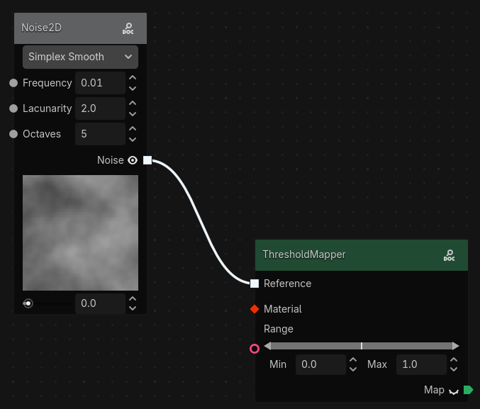
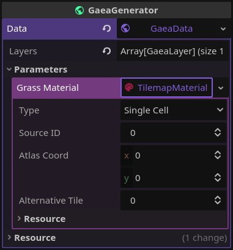
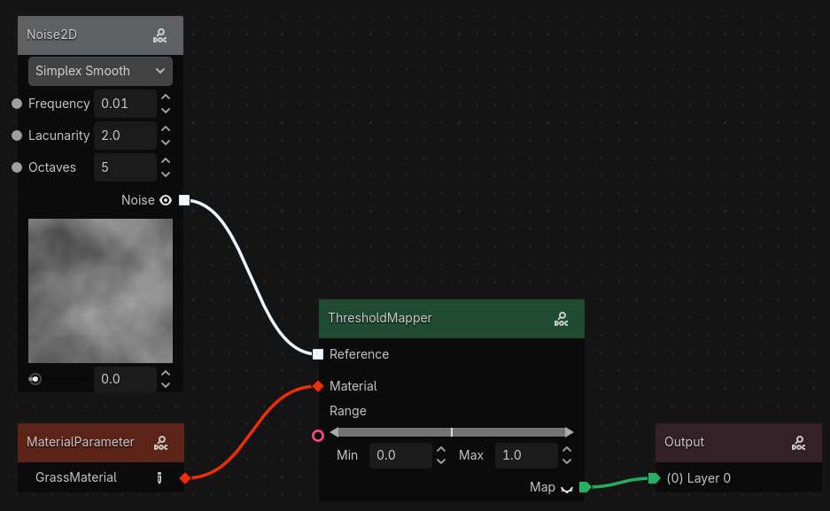
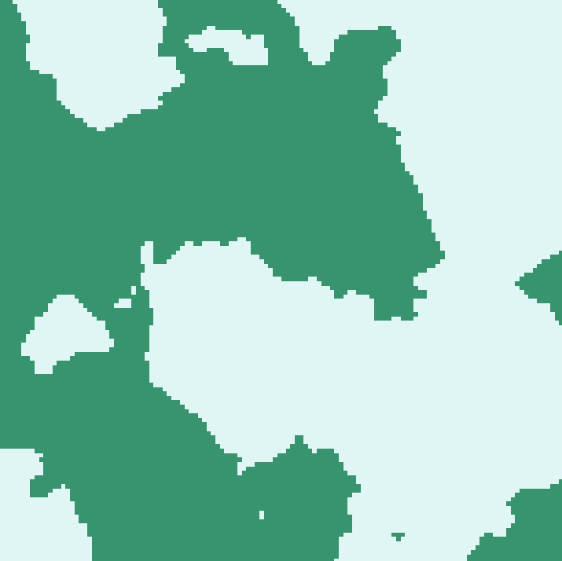
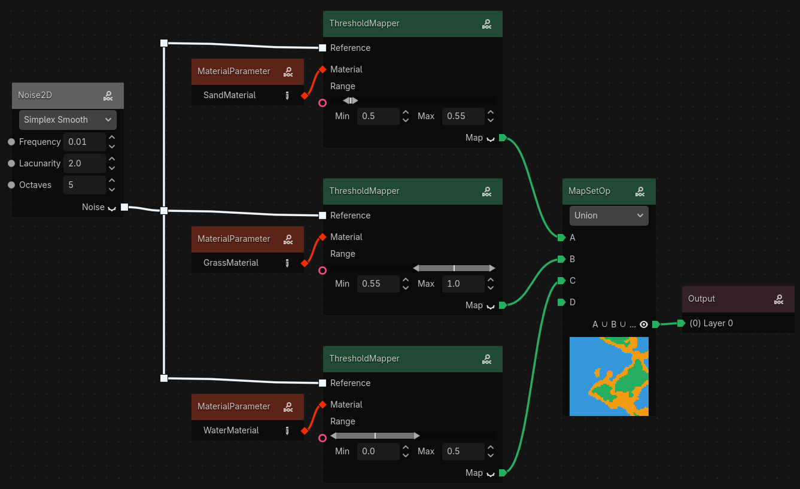
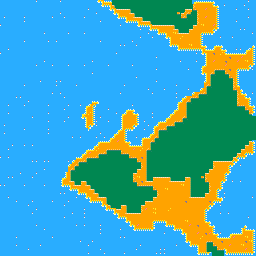

# Generating your first Terrain

In this tutorial we'll create a very simple terrain. This isn't the only way to generate terrain, but it'll get you in the right direction:

# Adding your Generator Node

As explained in [GaeaGenerator](../the-basics/generator.md), add your `GaeaGenerator` node and create a `GaeaGraph`, `GaeaGenerationSettings`, and `GaeaTaskPool` resource.

For this tutorial we will use a simple tile-based renderer.

So, add a `TileMapGaeaRenderer` node and assign the generator to it. Also add a [`TileMapLayer`](https://docs.godotengine.org/en/stable/classes/class_tilemaplayer.html) node and assign it to the first element of the renderer's `tile_map_layers` array.

You also need to setup your TileSet. Please refer to the [TileSet documentation](https://docs.godotengine.org/en/stable/tutorials/2d/using_tilesets.html#doc-using-tilesets) for more details on how to do that.

# Generating the Noise Data

Terrain is usually created with [noise](https://en.wikipedia.org/wiki/Perlin_noise), a black and white texture. Right click, and in the nodes list, under _Sampling/Noise_, you'll find the [`Noise2D`](../graph_nodes/Noise2d.md) node. Double click to add it. This node will be the base of our generation. Click the closed eye icon next to the data output to see the preview:

If you've never experimented with procedural generation, that may not look like much, but it's the base of the terrain from games like Minecraft or Terraria, and many others.

# Mapping it to Tiles

Now add a [`ThresholdMapper`](../graph_nodes/ThresholdMapper.md) node. _(Tip: you can search for nodes in the popup)_

This will allow to map certain values in the noise texture to [`GaeaMaterial`](../the-basics/material.md)s (tiles in [`TileMapRenderer`](../the-basics/renderer.md)s, elements in [`GridMapRenderer`](../the-basics/renderer.md)s, etc.). Move around the handles in the range parameter to whatever you want. In my case, I'll do `0.5`-`1.0`. Noise textures go from 0-1, 0 being completely black and 1 being completely white.

Connect the `Noise` output from the [`Noise2D`](../graph_nodes/Noise2d.md) node to the `input` of the [`ThresholdMapper`](../graph_nodes/ThresholdMapper.md) node by dragging the white square of the `Noise2D` node to the input reference of the `ThresholdMapper` node.

Now, we need a material. Create a [`MaterialParameter`](../graph_nodes/MaterialParameter.md) node.

# Parameters

In the inspector, click on the `GaeaGraph` resource. If you've added the parameter node, you'll see a parameters dropdown. Open it and you'll see your new parameter!

In the node, you can change the name of your parameter to whatever you want. Let's say, GrassMaterial. It'll automatically update in the inspector. Now set that parameter to a [`GaeaMaterial`](../the-basics/material.md) resource. For this example, we'll use a `TileMapGaeaMaterial`.

This resource tells the renderer what to draw. In this case, we set the type to `Single Cell`, and set the `Source ID`, `Atlas Coord` and `Alternative Tile` to match a grass tile in our TileSet. See the [Material](../the-basics/material.md) documentation for more details on how to set up your materials.

Now, connect the `MaterialParameter` node to the `material` input in the mapper. Finally, connect the mapper's `map` output to the `(0) Layer 0` input in the `Output` node.

That's it! Click the generate button in the top right of the panel and see the magic happen! It should look a bit like this:

# Adding More Terrain Types

You can add more terrain types by adding more mapper nodes, and merging their outputs with the [`MapSetOpUnion`](../graph_nodes/MapSetOpUnion.md) node. For example, this...

...generates this:

As you can see, nodes can output to multiple other nodes at the same time. (Like how the [`Noise2D`](../graph_nodes/Noise2d.md) node connects to multiple [`ThresholdMapper`](../graph_nodes/ThresholdMapper.md) nodes).

You can keep adding to this! You could even add decorations with layers, without having to make new tiles for each decoration and terrain type! Mess around with it as you'd like.

You can also do the same result using less nodes by using the [`GradientMaterial`](../the-basics/material.md#gradient-material) and setting different thresholds for each color in the gradient, but I wanted to show you how to use more nodes and merge them together.