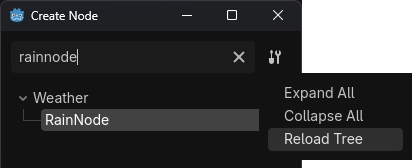

# Creating your Own Nodes

You can easily create new nodes to be used in your Gaea graphs. This tutorial will teach you how, how to configure it, and how to add it to your node list.

## Creating the Folder

Anywhere in your project, create a folder where you'll place your Gaea node scripts. You can name it whatever you want (for example, `custom_nodes`). The way your custom nodes will show up in the **Create Node** pop-up is based on the sub-folder they're placed in. So, for example, a node named **RainNode** in `custom_nodes/weather` will show up here:

Now, go to your Project Settings, and under `Gaea/Nodes`, you'll find a setting called **Custom Nodes Path**. Set it to your new folder. Now, your nodes will show up as available to be created.


If the node does not show up, make sure to click the **Reload tree** button in the settings in the top right of the add node pop-up. This will reload the list of available nodes, and your new node should be there.



Now your node should be showing up in the Create Node pop-up, under the category you placed it in. In this case, it's under Weather.


Your custom nodes can be placed in the already existing categories by copying the folder structure of `addons/gaea/runtime/graph_nodes/root`.

## Making your First Node


### Node script template

You can copy paste the following code as a template for your first node. It includes all the required methods with their correct signatures.

```
@tool
class_name RainNode
extends GaeaNodeResource

func _get_title() -> String:
	return "RainNode"


func _get_arguments_list() -> Array[StringName]:
	return []


@warning_ignore("unused_parameter")
func _get_argument_type(arg_name: StringName) -> GaeaValue.Type:
	return GaeaValue.Type.SAMPLE


func _get_output_ports_list() -> Array[StringName]:
	return []


@warning_ignore("unused_parameter")
func _get_output_port_type(output_name: StringName) -> GaeaValue.Type:
	return GaeaValue.Type.SAMPLE


@warning_ignore("unused_parameter")
func _get_data(output_port: StringName, pouch: GaeaGenerationPouch) -> Variant:
	return null
```

### Manually creating the node script

Add a script to your folder which inherits `GaeaNodeResource`. I recommend giving it a `class_name`, let's say `RainNode`. 

!!! important
    Your script has to be a [`@tool` script](https://docs.godotengine.org/en/stable/tutorials/plugins/running_code_in_the_editor.html), otherwise it will not work.

You'll probably get errors telling you which methods your script should implement. This is because `GaeaNodeResource` is an abstract class, with a few required methods. Implement them as instructed by the editor.

!!! warning
    Depending on your version, you should be careful when completing the function definitions with `Tab`, as you might run into a [messy completion](https://github.com/godotengine/godot/pull/108648); if you're in an affected version, you can just type it in manually.

Let's go one-by-one for each method:

### Methods overview

These are the methods you need to implement to create a working node. You can also implement other optional methods, such as `_get_description` to add a description to your node. You can check the in-editor documentation for `GaeaNodeResource` for more details on these methods and other optional ones.

#### Informations about the node

To give informations about your node, such as its name and description, you can override the following methods:

```
# This will be the name of your node.
func _get_title() -> String:
	return "RainNode"
```

```
# This will be the description of your node.
func _get_description() -> String:
	return "This is a node that generates rain."
```

```
# This will be the corresponding node icon to be used in the 'Create Node' list.
# If not overriden, returns the default icon for the node's type.
func _get_icon() -> Texture:
	return load("res://path_to_your_icon.png")
```

```
# Override this method to define hide the documentation button
func _display_documentation_button() -> bool:
	return true
```

```
# This allow you to add extra documentation to your node.
# See DocumentationSection for the available sections.
func _get_extra_documentation(for_section: DocumentationSection) -> String:
	if for_section == DocumentationSection.DESCRIPTION:
		return ("A cell being mapped to [param material] means that, in the output Map, " +
				"that cell will contain that material.")
	return super(for_section)
```

```
# If this returns false, this node won't show up in the 'Create Node' dialog.
# By default, it hides nodes with the @GDScript.@abstract annotation.
func _is_available() -> bool:
	return true
```

```
# Override to append custom data to the saved data in [GaeaGraph._node_data].
func _get_custom_saved_data() -> Dictionary[StringName, Variant]:
	return {&"reroute_type": type}
```

```
# Should be overridden if the node should use a different scene in the Gaea editor from the base one.
func _get_scene() -> PackedScene:
	return load("res://path_to_your_scene.tscn")
```

```
# Should be overridden if the node should use a different script in the Gaea editor from the base one.
func _get_scene_script() -> GDScript:
	return load("res://path_to_your_script.gd")
```

```
# Override this method to change the items shown in the 'Create Node' dialog related to this resource.
# This also allow you to define variation nodes using the same script.
func _get_tree_items() -> Array[GaeaNodeResource]:
	var items: Array[GaeaNodeResource]
	for operation: Operation in _get_enum_options(0).values():
		var item: GaeaNodeResource = get_script().new()
		var operation_name: String = Operation.find_key(operation).to_pascal_case()
		var symbol: String = OPERATION_SYMBOLS[operation]
		var tree_name := "%s (%s)" % [operation_name, symbol]
		item.set_tree_name_override(tree_name)
		item.set_default_enum_value_override(0, operation)
		item.set_default_argument_value_override(0, 0)
		items.append(item)
	return items
```

#### Enums

Enums are dropdowns that let you select from predefined options. They can change the node behavior and available argument or outputs.

To create an enum, you need to override the following methods:

```
# This will be the number of enums in your node.
func _get_enums_count() -> int:
	return 2
```

```
# This will be the name of the enum at index enum_idx.
func _get_enum_title(enum_idx: int) -> String:
	return "Enum #" + str(enum_idx + 1)
```

```
# This will be the description of the enum at index enum_idx.
func _get_enum_description(enum_idx: int) -> String:
	return "Description for enum #" + str(enum_idx + 1)
```

```
enum InputVar { WORLD_SIZE, AREA_SIZE, AREA_POSITION, AREA_END }

# This will be the options of the enum at index enum_idx. The returned Dictionary
# should be {String: int}. Enums defined in GDScript can be used directly.
func _get_enum_options(enum_idx: int) -> Dictionary:
	if enum_idx == 0:
		return InputVar
	return {
		"Option 1": 0,
		"Option 2": 1,
	}
```

```
# This will be the display name of the options of the enum at index enum_idx.
# By default, it's the name of the option in _get_enum_options() capitalized,
# but you can override it with this method.
func _get_enum_option_display_name(enum_idx: int, option_value: int) -> String:
	if enum_idx == 0:
		return "%s InputVar" % InputVar.find_key(option_value)
	return "Option %d" % (option_value + 1)
```

```
# This will be the icon displayed in the options of the enum at index enum_idx.
func _get_enum_option_icon(_enum_idx: int, option_value: int) -> Texture:
	return GaeaValue.get_display_icon(_get_type_of_input(option_value))
```

```
# This will be the default value of the enum at index enum_idx.
func _get_enum_default_value(enum_idx: int) -> int:
	if enum_idx == 0:
		return InputVar.WORLD_SIZE
	return 0
```

```
# This method is called when the value of the enum at index enum_idx is changed in the editor.
# You can use it to call notify_argument_list_changed() to update the arguments list if needed.
# When overridden, super() should always be called at the head of the function.
func _on_enum_value_changed(enum_idx: int, option_value: int) -> void:
	super()
	notify_argument_list_changed()
```

#### Arguments

Arguments are editable parameters that control how the node behaves. They can be numbers, booleans, resources, or other types.


To create an argument, you need to override the following methods:

```
# This will be the list of arguments available in your node. The names should be preferably snake_case.
func _get_arguments_list() -> Array[StringName]:
	if get_enum_selection(0) == InputVar.WORLD_SIZE:
		return ["world_size"]
	return [&"my_argument"]
```

```
# Returns an array of the name of the arguments that are expected to be connected
# for the Node Resource to execute properly.
func _get_required_arguments() -> Array[StringName]:
	return []
```

```
# This will be the display name of the argument
# By default, it's arg_name.capitalize(), but you can override it with this method.
func _get_argument_display_name(arg_name: StringName) -> String:
	if arg_name == "world_size":
		return "World Size"
	return arg_name.capitalize()
```

```
# This will be the description of the argument of name arg_name.
func _get_argument_description(arg_name: StringName) -> String:
	if arg_name == "world_size":
		return "The size of the generated world."
	return ""
```

```
# This will be the type of the argument of name arg_name. The type should be one of GaeaValue.Type.
func _get_argument_type(arg_name: StringName) -> GaeaValue.Type:
	if arg_name == "world_size":
		return GaeaValue.Type.VECTOR3
	return GaeaValue.Type.FLOAT
```

```
# This will the argument hint of the argument of name arg_name.
func _get_argument_hint(arg_name: StringName) -> Dictionary[String, Variant]:
	if arg_name == "world_size":
		return {
			"min": Vector3(1, 1, 1),
		}
	return {}
```

```
# This will be the default value of the argument of name arg_name.
func _get_argument_default_value(arg_name: StringName) -> Variant:
	if arg_name == "world_size":
		return Vector3(100, 100, 1)
	return 0.0
```

```
# Override this method to determine whether or not arguments can be connected to.
# Note: Some argument types can't have input slots. See GaeaValue.is_wireable().
func _has_input_slot(arg_name: StringName) -> bool:
	if arg_name == "world_size":
		return false
	return true
```

#### Outputs

Outputs are the values produced by the node. The output slot type determines what kind of data it produces (for example, a `Noise2D` node has a `Sample` output slot that produces a grid of `float`s).


To create an output, you need to override the following methods:

```
# This will be the list of outputs available in your node. The names should be preferably snake_case.
func _get_output_ports_list() -> Array[StringName]:
	if get_enum_selection(0) == InputVar.WORLD_SIZE:
		return ["output_map"]
	return ["output_value"]
```

```
# This will be the display name of the output
# By default, it's output_name.capitalize(), but you can override it with this method.
func _get_output_port_display_name(output_name: StringName) -> String:
	if output_name == "output_map":
		return "Output Map"
	return output_name.capitalize()
```

```
# This will be the description of the output of name output_name.
func _get_output_port_description(output_name: StringName) -> String:
	if output_name == "output_map":
		return "The generated output map."
	return ""
```

```
# This will be the type of the output of name output_name. The type should be one of GaeaValue.Type.
func _get_output_port_type(output_name: StringName) -> GaeaValue.Type:
	if output_name == "output_map":
		return GaeaValue.Type.VECTOR3
	return GaeaValue.Type.FLOAT
```

```
# If this returns a value higher than 0, the output slot for output_name will
# be added in that index instead of below the arguments.
func _get_overridden_output_port_idx(_output_name: StringName) -> int:
	return 0
```

```
# Checks if this node should use caching or not for the given output port. Can be overridden to disable it.
func _use_caching(output_port: StringName) -> bool:
	return output_port == "output_map"
```

```
# This is where you'll implement the functionality of your node.
# It should return the value corresponding to output_port.
# The pouch contains the current generation context, such as the area being generated, the seed, etc.
func _get_data(output_port: StringName, pouch: GaeaGenerationPouch) -> Variant:
	if output_port == "output_map":
		# Generate the output map based on the world size argument and the area.
		var world_size = _get_arg(&"world_size", pouch)
		var output_map = generate_output_map(world_size, pouch.area)
		return output_map
	return 0.0
```

#### Virtual methods

The following methods are used to implement the functionality of your node.

```
# This method is called when the node is added to a graph.
func _on_added_to_graph():
	pass
```

```
# This method is called when the node is removed from a graph.
func _on_removed_from_graph():
	pass
```

```
# Called when an enum is changed in the editor. Does nothing by default, but can be used to
# call notify_argument_list_changed() to rebuild the node.
func _on_argument_value_changed(arg_name: StringName, new_value: Variant) -> void:
	notify_argument_list_changed()
	notify_argument_hint_changed(arg_name)
```

### Tips and Tricks

Take the time to comment your node and use the descriptions virtual method. This will help the future yourself or other developers who work with your node, as they will have useful information on the usage of some methods and variables.

Great! And that's it! You can see the node is working as expected:

For other node creation stuff, you can look at the in-editor documentation for `GaeaGraphNode` and/or the [code of all built-in nodes](https://github.com/gaea-godot/gaea/tree/2.0/addons/gaea/runtime/graph_nodes/root). 
