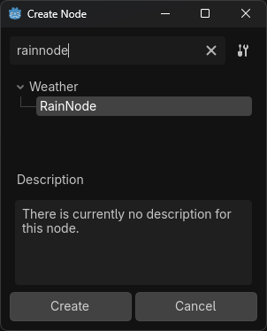
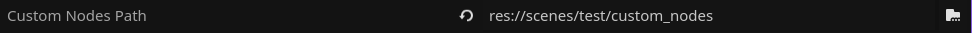
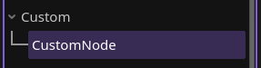
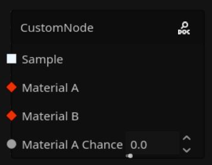
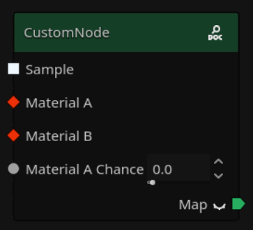
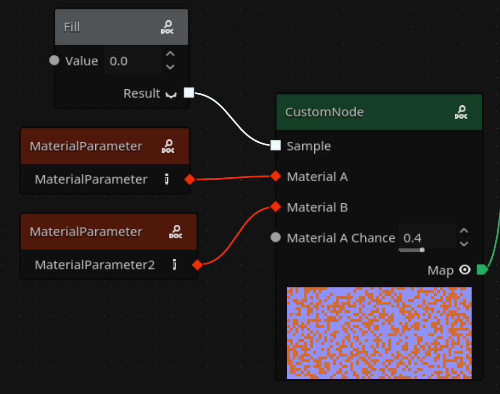

# Creating your Own Nodes

You can easily create new nodes to be used in your Gaea graphs. This tutorial will teach you how, how to configure it, and how to add it to your node list.

## Creating the Folder

Anywhere in your project, create a folder where you'll place your Gaea node scripts. You can name it whatever you want (for example, `custom_nodes`). The way your custom nodes will show up in the **Create Node** pop-up is based on the sub-folder they're placed in. So, for example, a node named **Fill** in `custom_nodes/data/basic` will show up here:



Your custom nodes can be placed in the already existing categories by copying the folder structure of `addons/gaea/graph/graph_nodes/root/`.

Now, go to your Project Settings, and under `Gaea/Nodes`, you'll find a setting called **Custom Nodes Path**. Set it to your new folder. Now, your nodes will show up as available to be created.


## Making your First Node

Add a script to your folder which inherits `GaeaNodeResource`. I recommend giving it a `class_name`, let's say `CustomNode`. 

!!! important
    Your script has to be a [`@tool` script](https://docs.godotengine.org/en/stable/tutorials/plugins/running_code_in_the_editor.html), otherwise it will not work.

If you're using *Godot 4.5*, you'll probably get errors telling you which methods your script should implement. This is because `GaeaNodeResource` is an abstract class, with a few required methods. Implement them as instructed by the editor.

!!! warning
    Depending on your version, you should be careful when completing the function definitions with `Tab`, as you might run into a [crash](https://github.com/godotengine/godot/issues/108639); if you're in an affected version, you can just type it in manually.

Let's go one-by-one for each method:

#### `_get_title()`

This will be the name of your node. It should return a `String`. For example, `"CustomNode"`.


#### `_get_arguments_list()`

This will be your list of configurable arguments when the node is added onto the graph. Return an empty `Array` for now. We'll come back to this one later.

#### `_get_argument_type(arg_name: StringName)`

Returns the type of the argument of name `arg_name`. Return `GaeaValue.Type.NULL` for now. We'll also come back to this one later.

#### `_get_output_ports_list()`

This will be your list of outputtable values, the slots on the right of the node. Like in the arguments list, leave it empty for now.


#### `_get_output_port_type(output_name: StringName)`

Same as `_get_argument_type`, but for outputs.


#### `_get_data(output_port: StringName, area: AABB, graph: GaeaGraph)`

This one's very important. It's where you'll implement the custom functionality of your node. Return `null` for now, we'll come back to it later.

### Having Arguments

Great, now you have a node defined. If you go to a generator's graph, and click the **Reload create node list** button () in the top left of the panel, you'll see your new node under the category you placed it in, next to all other built-in nodes.



You'll notice that when you add it to your graph, it will be sad and empty. This is because of the methods we left unimplemented before. Let's implement them now, starting with arguments.

Let's say we want our node to randomly map each cell of a sample grid to 1 of 2 materials, and output that new created map.

We'll need:

- A sample input,
- 2 `GaeaMaterial` inputs,
- A float between `0.0` to `1.0` that will represent the chance of the first material being selected (otherwise, the second one will be used).

Let's go back to `_get_arguments_list` and make it return `[&"sample", &"material_a", &"material_b", &"material_a_chance"]`.
<br>Now let's go to `_get_argument_type`, and using `match`, return `GaeaValue.Type.SAMPLE` for the first argument, `GaeaValue.Type.MATERIAL` for the next 2, and `GaeaValue.Type.FLOAT` for the last one. Like this:


```
func _get_arguments_list() -> Array[StringName]:
	return [&"sample", &"material_a", &"material_b", &"material_a_chance"]


func _get_argument_type(arg_name: StringName) -> GaeaValue.Type:
	match arg_name:
		&"sample":
			return GaeaValue.Type.SAMPLE
		&"material_a", &"material_b":
			return GaeaValue.Type.MATERIAL
		&"material_a_chance":
			return GaeaValue.Type.FLOAT
	return GaeaValue.Type.NULL
```

!!! note
    You can learn all the available types at [Anatomy of a Graph > Slot Types](../the-basics/anatomy-of-a-graph.md#slot-types)

Now, your node will look like this:



Great, but **Material A Chance** should only be a value between `0.0` and `1.0`. Right now, it's not limited to any range. To change this, implement `_get_argument_hint(arg_name: StringName)`. This works similar to property hints in Godot's editor, in that it allows to limit arguments to ranges, change how they work, etc. In this case, we'll return `{"min": 0.0, "max": 1.0}` if the argument is `material_a_chance`, otherwise it'll resort to the default implementation:

```
func _get_argument_hint(arg_name: StringName) -> Dictionary[String, Variant]:
	if arg_name == &"material_a_chance":
		return {"min": 0.0, "max": 1.0}
		
	return super(arg_name)
```

Now, in your graph, that argument will be limited to that range, and will even include a nifty slider.

### *Put* it *Out* There

Now that we have our required arguments, let's implement the node's output. Like with the arguments, override `_get_output_ports_list` and `_get_output_port_type` as needed. In my case:

```
func _get_output_ports_list() -> Array[StringName]:
	return [&"map"]


func _get_output_port_type(_output_name: StringName) -> GaeaValue.Type:
	return GaeaValue.Type.MAP
```

!!! note
    Notice how I added an underscore `_` to `output_name`, as I don't use it inside the function (since there's only one output).




Your node will be looking nicer now! It has defaulted to using the map type's titlebar color, and now includes a `Map` output with a preview button. Now that it has an output, it's ready to be implemented.

### It's Magic!

Now it's time to write your custom logic in `_get_data`. This method will return what you want your node to output, and you can use logic to change what this means based on the `output_port` function argument.

To get the values of your arguments, you can use `_get_arg(<arg_name>, area, graph)`. If, for example, one of your arguments is invalid (a material isn't connected), you can use `_log_error` to notify the user of the problem.

This is the code for the node we're making in this tutorial:

```
# Note that I changed the return type to Dictionary[Vector3i, GaeaMaterial]. 
# That's how we represent data of GaeaValue.Type.MAP in the code. 
func _get_data(_output_port: StringName, area: AABB, graph: GaeaGraph) -> Dictionary[Vector3i, GaeaMaterial]:
	var grid: Dictionary[Vector3i, GaeaMaterial] = {}
    # GaeaValue.Type.SAMPLE is Dictionary[Vector3i, float] but Godot sometimes gives errors when typing 
    # this variable as that, so we just use Dictionary.
	var sample: Dictionary = _get_arg(&"data", area, graph) 
	var material_a: GaeaMaterial = _get_arg(&"material_a", area, graph)
	var material_b: GaeaMaterial = _get_arg(&"material_b", area, graph)
	var material_a_chance: float = _get_arg(&"material_a_chance", area, graph)

	if not is_instance_valid(material_a):
		_log_error("Invalid material A provided", graph)
		return grid

	if not is_instance_valid(material_b):
		_log_error("Invalid material B provided", graph)
		return grid

    
    # We call execute_sample on materials when using them in a map.
	for cell in sample:
        # We use the rng variable for ANY randomnness-related code.
		if rng.randf() <= material_a_chance:
			grid.set(
				cell,
				material_a.execute_sample(rng, sample.get(cell)) 
			)
		else:
			grid.set(
				cell,
				material_b.execute_sample(rng, sample.get(cell))
			)

    return grid
```

Note the code comments, they have useful information on the usage of some methods and variables.

Great! And that's it! You can see the node is working as expected:



For other node creation stuff, you can look at the in-editor documentation for `GaeaGraphNode` and/or the [code of all built-in nodes](https://github.com/gaea-godot/gaea/tree/2.0/addons/gaea/graph/graph_nodes/root). 

You can add a description for example (`_get_description`), or choices (called enums in code) like in `Noise2D`, etc. The possibilities are endless, and if you make an exciting node you can share it to the Gaea repo and we might implement it.

Get making!


For reference, the final script looks like this:
```
@tool
class_name CustomNode
extends GaeaNodeResource


func _get_title() -> String:
	return "CustomNode"


func _get_arguments_list() -> Array[StringName]:
	return [&"sample", &"material_a", &"material_b", &"material_a_chance"]


func _get_argument_type(arg_name: StringName) -> GaeaValue.Type:
	match arg_name:
		&"sample":
			return GaeaValue.Type.SAMPLE
		&"material_a", &"material_b":
			return GaeaValue.Type.MATERIAL
		&"material_a_chance":
			return GaeaValue.Type.FLOAT
	return GaeaValue.Type.NULL


func _get_argument_hint(arg_name: StringName) -> Dictionary[String, Variant]:
	if arg_name == &"material_a_chance":
		return {"min": 0.0, "max": 1.0}
		
	return super(arg_name)


func _get_output_ports_list() -> Array[StringName]:
	return [&"map"]


func _get_output_port_type(_output_name: StringName) -> GaeaValue.Type:
	return GaeaValue.Type.MAP


func _get_data(_output_port: StringName, area: AABB, graph: GaeaGraph) -> Dictionary[Vector3i, GaeaMaterial]:
	var grid: Dictionary[Vector3i, GaeaMaterial] = {}
    # GaeaValue.Type.SAMPLE is Dictionary[Vector3i, float] but Godot sometimes gives errors when typing 
    # this variable as that, so we just use Dictionary.
	var sample: Dictionary = _get_arg(&"sample", area, graph) 
	var material_a: GaeaMaterial = _get_arg(&"material_a", area, graph)
	var material_b: GaeaMaterial = _get_arg(&"material_b", area, graph)
	var material_a_chance: float = _get_arg(&"material_a_chance", area, graph)

	if not is_instance_valid(material_a):
		_log_error("Invalid material A provided", graph)
		return grid

	if not is_instance_valid(material_b):
		_log_error("Invalid material B provided", graph)
		return grid

    # We call execute_sample on materials when using them in a map.
	for cell in sample:
        # We use the rng variable for ANY randomnness-related code.
		if rng.randf() <= material_a_chance:
			grid.set(cell, material_a.execute_sample(rng, sample.get(cell)) )
		else:
			grid.set(cell, material_b.execute_sample(rng, sample.get(cell)))
	return grid
```
